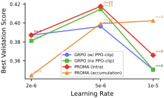
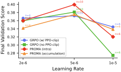
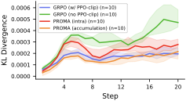
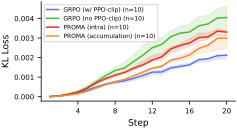

# Projected Microbatch Accumulation yields reference-free PPO

**Nilin Abrahamsen**

This repo contains a demonstration of the Projected Microbatch Accumulation (PROMA), [arxiv:2601.10498](https://arxiv.org/abs/2601.10498). 

### Description

Projected Microbatch Accumulation (PROMA) is a reference-free proximal policy method that controls KL divergence by projecting away high-variance components of the policy gradient. Two variants are presented. In the accumulation-based variant, the running gradient is projected orthogonal to the sequence-wise log-probability gradients of each microbatch. In the intra-microbatch variant, a factored projection using dominant subspaces of activations and gradient outputs is applied independently within each microbatch, making it compatible with standard data-parallel training. Empirically, the accumulation variant achieves tighter per-step KL control than GRPO with PPO clipping, while the intra-microbatch variant achieves the best validation performance.

### Results (MBPP &rarr; HumanEval, Qwen-3 0.6B)

PROMA (intra) achieves the highest validation score, while PROMA (accumulation) is the most robust to higher learning rates. Both PROMA variants maintain tighter per-step KL control than unclipped GRPO, comparable to PPO clipping, without relying on likelihood ratio clipping.

&nbsp;

&nbsp;

### Implementation

This demonstration is a fork of [VeRL](https://github.com/volcengine/verl). The implementation of PROMA (and [ISOPO](https://arxiv.org/abs/2512.23353)) are in [verl/workers/actor/dp_actor.py](https://github.com/nilin/proma2/tree/main/verl/workers/actor/dp_actor.py).

## Usage

- [launch using docker](launch.sh)
